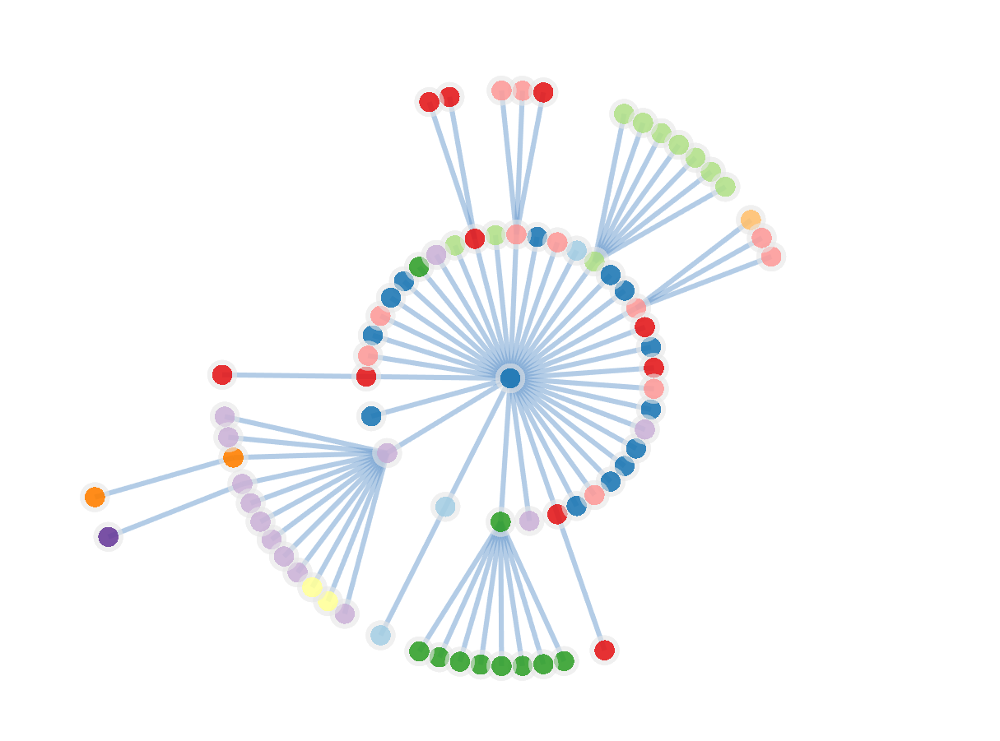
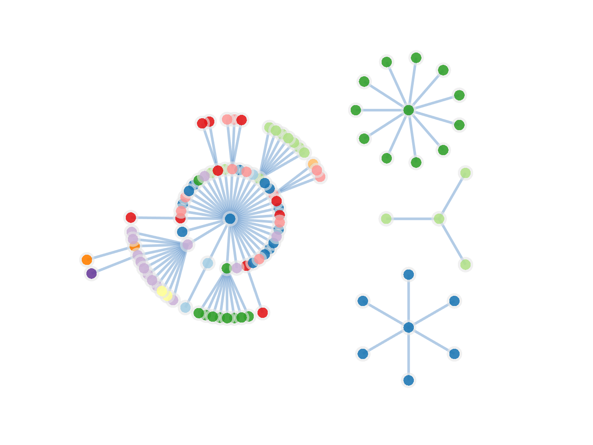

# NetV.js + D3.js Radial Tree




## Usage

### Basic radial layout

single tree, can config center and radius

```js
tree = radialLayout(graph, rootId, configs)
netv.data(tree)
```

* graph: basic json-like graph, like NetV's build-in dataset
* rootId: centered rootNode's ID 
* configs: { directed: bool, radius: number, centerX: number, centerY: number }
    * directed: process as directed or not
    * radius: max radius of radial tree
    * centerX, centerY: position of center node

demo: `examples/miserables`

### Multiple tree radial layout

given container, auto layout for all trees


```js
tree = radialLayout(graph, rootId, configs)
netv.data(tree)
```

* graph: basic json-like graph, like NetV's build-in dataset
* rootId: centered rootNode's ID 
* configs: { directed: bool, width: number, height: number}
    * directed: process as directed or not
    * width, height: container's size

demo: `examples/miserables-and-more`